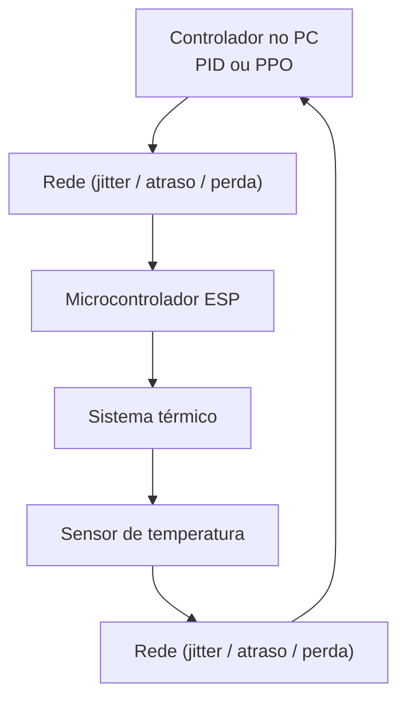

# Termociclador PCR — Controle Térmico Inteligente

Projeto de TCC que investiga o controle térmico de um termociclador PCR,
equipamento utilizado em biologia molecular para amplificação de DNA.

O trabalho compara duas abordagens de controle em ambiente simulado:

- Controle clássico com **PID**
- Controle baseado em **Inteligência Artificial (Reinforcement Learning — PPO)**

A simulação considera efeitos reais de rede como **latência, jitter e perda de pacotes**,
representando um cenário de controle distribuído entre um computador e um microcontrolador.

---

## Resultado principal

Comparação entre PID clássico e IA (PPO) sob condições de rede com jitter:


O agente PPO demonstrou maior robustez aos efeitos de rede, mantendo o rastreamento
do setpoint mesmo com leituras atrasadas e comandos perdidos — comportamento
que o PID clássico não consegue reproduzir sem ajuste dinâmico de ganhos.

---

## Arquitetura do sistema

O experimento simula um sistema de controle térmico distribuído.
O controlador (PID ou PPO) roda no PC, enquanto o sistema físico
é representado por um modelo térmico de primeira ordem equivalente
ao comportamento de um termociclador PCR.

A comunicação entre controlador e sistema físico é simulada com dois canais de rede:

```
PC ──[atraso / jitter / perda]──► ESP ──► Planta térmica
PC ◄──[atraso / jitter / perda]── ESP ◄── Sensor de temperatura
```



---

## Objetivos

- Desenvolver a estrutura de hardware do termociclador PCR
- Implementar e comparar controladores PID e PPO para controle de temperatura
- Avaliar o impacto de efeitos de rede no desempenho dos controladores
- Automatizar os ciclos térmicos do processo de PCR
- Integrar software e eletrônica em um protótipo funcional

---

## Modelo térmico

O sistema é modelado por uma equação diferencial de primeira ordem discreta:

```
T(k+1) = T(k) + dt × (β×u − α×(T(k) − Tamb)) + ruído
```

| Parâmetro | Descrição |
|---|---|
| `u ∈ [−1, 1]` | sinal de controle (negativo resfria, positivo aquece) |
| `β = 3.0` | ganho térmico do atuador |
| `α = 0.02` | coeficiente de perda de calor para o ambiente |
| `Tamb = 25°C` | temperatura ambiente |
| `noise ~ N(0, 0.05)` | ruído gaussiano do sensor |

---

## Perfil de temperatura (PCR)

| Fase | Temperatura | Duração | Função biológica |
|---|---|---|---|
| Estabilização | 25°C | 10s | Sistema parte da temperatura ambiente |
| Desnaturação | 95°C | 20s | Separação das fitas de DNA |
| Anelamento | 55°C | 20s | Primers se ligam ao DNA |
| Extensão | 72°C | 20s | Polimerase replica o DNA |

---

## Estrutura do repositório

```
termociclador-pcr/
│
├── README.md
├── requirements.txt
├── LICENSE
│
├── simulador/
│   ├── modelo_termico.py       # modelo físico do sistema térmico
│   ├── setpoint.py             # perfil de temperatura PCR
│   ├── pid_baseline_final.py   # controlador PID + simulação sem rede
│   ├── pid_com_jitter.py       # PID com simulação de rede
│   └── confronto_final.py      # ambiente PPO + comparação PID vs IA
│
└── graficos/
    ├── resultado_final.png
    ├── 01_comparativo_pid_vs_ppo.png
    ├── 02_pid_sensor_real_vs_visualizada.png
    ├── 03_pid_comando_ucmd_vs_uaplicado.png
    └── 04_ppo_sensor_real_vs_visualizada.png
```

---

## Como executar

**1. Clone o repositório:**
```bash
git clone https://github.com/evandroflausinoo/termociclador-pcr.git
cd termociclador-pcr
```

**2. Instale as dependências:**
```bash
pip install -r requirements.txt
```

**3. Execute a comparação PID vs IA:**
```bash
python simulador/confronto_final.py
```

**4. Execute apenas o PID baseline (sem efeitos de rede):**
```bash
python simulador/pid_baseline_final.py
```

**5. Execute o PID com jitter:**
```bash
python simulador/pid_com_jitter.py
```

---

## Tecnologias

| Tecnologia | Uso |
|---|---|
| Python 3.10+ | linguagem principal |
| Stable-Baselines3 | treinamento do agente PPO |
| Gymnasium | ambiente de simulação para RL |
| NumPy | operações numéricas e seed de reprodutibilidade |
| Matplotlib | visualização dos resultados |

---

## Status

Simulação concluída. Protótipo físico em desenvolvimento (aguardando montagem de hardware).

---

## Autor

**Evandro Flausino**  
[github.com/evandroflausinoo](https://github.com/evandroflausinoo)
