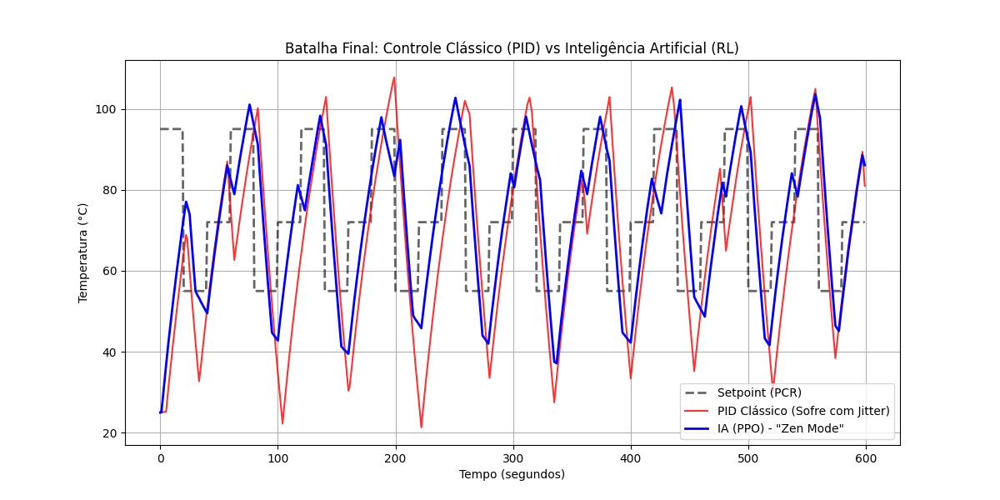

# Termociclador PCR - Controle Térmico Inteligente

Este projeto faz parte do desenvolvimento de um termociclador PCR,
um equipamento utilizado em biologia molecular para amplificação de DNA.

O trabalho investiga o controle térmico do equipamento e compara duas abordagens:

- Controle clássico usando **PID**
- Controle baseado em **Inteligência Artificial (Reinforcement Learning - PPO)**

A simulação também considera efeitos de rede como **latência, jitter e perda de pacotes**,
representando um cenário de controle distribuído entre um computador e um microcontrolador.

## Objetivos

- Desenvolver a estrutura de hardware do equipamento
- Implementar o controle de temperatura
- Automatizar os ciclos térmicos do processo de PCR
- Integrar software e eletrônica em um protótipo funcional

## Tecnologias e componentes

- Linguagem Python
- Microcontrolador
- Sensores de temperatura
- Sistema de aquecimento
- Ponte H / módulo de acionamento
- Estrutura de controle térmico

## Estrutura do repositório
```
termociclador-pcr
│
├── README.md
├── requirements.txt
│
├── simulador
│   ├── modelo_termico.py
│   ├── setpoint.py
│   ├── pid_baseline.py
│   ├── pid_jitter.py
│   └── comparacao_pid_vs_rl.py
│
└── graficos
    └── resultado_final.png
```

## Status do projeto

Projeto em desenvolvimento.

## Resultado da Simulação

Comparação entre controle clássico (PID) e Inteligência Artificial (PPO)
no controle térmico de um termociclador PCR sob condições de rede com jitter.



## Como rodar a simulação

1. Clone o repositório:
https://github.com/evandroflausinoo/termociclador-pcr.git

2. Entre na pasta do projeto:
cd termociclador-pcr

4. Instale as dependências (Python):
pip install -r requirements.txt

6. Execute a simulação de comparação entre PID e IA:
python simulador/comparacao_pid_vs_rl.py

7. Isso irá gerar gráficos comparando o controle PID clássico com o controle baseado em Reinforcement Learning (PPO).

## Autor

Evandro Flausino
