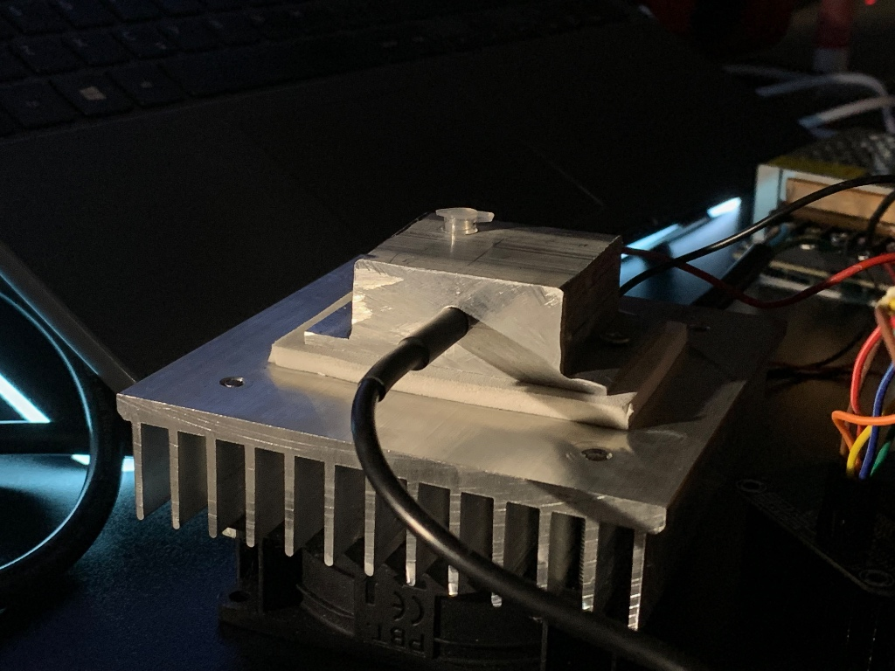
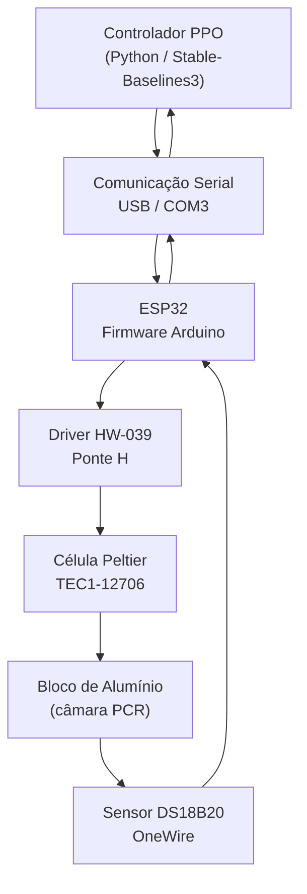

# Termociclador PCR - Controle Térmico com Inteligência Artificial

(GIT.DESATUALIZADO)

Projeto de TCC que desenvolve e valida um termociclador PCR controlado por
Reinforcement Learning (PPO), comparando com controle clássico PID em cenário
de comunicação distribuída com efeitos de rede reais.



---

## Resultado principal - Hardware Real

Evolução do controle ao longo das versões testadas no hardware físico:

| Versão | Tipo de Ação | MAE Global | Temp Máxima | Passos ≥95°C |
|--------|-------------|-----------|-------------|--------------|
| PPO v1 | - (sem Peltier) | 43.6°C | 30.0°C | 0 |
| PPO v2 | Discreta {-1, 0, +1} | 19.7°C | 72.3°C | 0 |
| PPO v3 | Contínua [-1.0, +1.0] | 16.1°C | **99.7°C** | **59** |

O PPO v3 com ação contínua e parâmetros calibrados com dados reais
atingiu 99.7°C e manteve acima de 95°C por 59 segundos consecutivos.

---

## Arquitetura do sistema

```
PC ──[Serial / USB]──► ESP32 ──► Driver HW-039 ──► Peltier TEC
PC ◄──[Serial / USB]── ESP32 ◄── Sensor DS18B20
```

O controlador PPO roda no PC e se comunica com o ESP32 via Serial.
O ESP32 controla o driver de potência que alimenta a célula Peltier.


```mermaid
flowchart TD
    PC["Controlador PPO\n(Python / Stable-Baselines3)"]
    SERIAL["Comunicação Serial\nUSB / COM3"]
    ESP["ESP32\nFirmware Arduino"]
    DRIVER["Driver HW-039\nPonte H"]
    PELTIER["Célula Peltier\nTEC1-12706"]
    SENSOR["Sensor DS18B20\nOneWire"]
    BLOCO["Bloco de Alumínio\n(câmara PCR)"]

    PC --> SERIAL
    SERIAL --> ESP
    ESP --> DRIVER
    DRIVER --> PELTIER
    PELTIER --> BLOCO
    BLOCO --> SENSOR
    SENSOR --> ESP
    ESP --> SERIAL
    SERIAL --> PC
```

---

## Hardware utilizado

| Componente | Especificação |
|------------|---------------|
| Microcontrolador | ESP32 DevKit |
| Célula Peltier | TEC1-12706 (12V / 6A) |
| Driver de potência | HW-039 (Ponte H dupla) |
| Sensor de temperatura | DS18B20 (OneWire) |
| Fonte de alimentação | Chaveada 12V / 5A |
| Bloco térmico | Alumínio usinado |
| Dissipador | Alumínio com cooler 12V |

---

## Perfil de temperatura PCR

| Fase | Temperatura | Duração | Função biológica |
|------|-------------|---------|-----------------|
| Estabilização | 25°C | 20s | Sistema parte da temperatura ambiente |
| Desnaturação | 95°C | 120s | Separação das fitas de DNA |
| Anelamento | 55°C | 180s | Primers se ligam ao DNA |
| Extensão | 72°C | 120s | Polimerase replica o DNA |

---

## Modelo térmico (simulação)

A simulação usa uma equação diferencial discreta de primeira ordem
calibrada com dados reais do hardware:

```
T(k+1) = T(k) + dt × (β×u − α×(T(k) − Tamb)) + ruído
```

| Parâmetro | Simulação original | Calibrado com hardware |
|-----------|-------------------|----------------------|
| `β` (ganho Peltier) | 3.0 | **0.4** (~0.4°C/s real) |
| `α` (perda de calor) | 0.02 | **0.005** |
| `noise_std` | 0.05 | **0.3** |
| `Tamb` | 25°C | 25°C |

---

## Evolução dos modelos PPO

### v1 - Baseline
- Ação discreta {-1, 0, +1}
- Parâmetros de simulação originais (β=3.0)
- Testado apenas com sensor (sem Peltier conectada)

### v2 - Peltier conectada
- Ação discreta {-1, 0, +1}
- Mesmo treinamento da simulação
- Temperatura máxima: 72°C

### v3 - Calibrado com hardware real ✓
- **Ação contínua [-1.0, +1.0]** - controle proporcional de PWM
- Parâmetros calibrados com dados reais (β=0.4, α=0.005)
- Temperatura máxima: **99.7°C**
- Atingiu e manteve 95°C por 59 passos consecutivos
- Resfriamento ativo com -1.0 ao sair de 99°C→55°C

---

## Estrutura do repositório

```
termociclador-pcr/
│
├── README.md
├── requirements.txt
│
├── simulador/
│   ├── modelo_termico.py           # modelo físico calibrado
│   ├── setpoint.py                 # perfil de temperatura PCR
│   ├── pid_baseline_final.py       # controlador PID sem rede
│   ├── pid_com_jitter.py           # PID com simulação de rede
│   ├── confronto_final.py          # ambiente PPO v3 + comparação
│   ├── real_world_control.py       # interface com hardware real
│   └── graficos/                   # gráficos gerados
│   └── modelos/                    # modelos de treinamento
│   └── logs/
│   └── treinos/
│
└── firmware/
    └── teste_sensor_pcr.ino        # firmware ESP32
```

---

## Como executar

**1. Clone o repositório:**
```bash
git clone https://github.com/evandroflausinoo/termociclador-pcr.git
cd termociclador-pcr
```

**2. Instale as dependências:**
```bash
pip install -r requirements.txt
```

**3. Simulação - PID vs PPO:**
```bash
python simulador/confronto_final.py
```

**4. Hardware real - rodar a IA:**
```bash
# Grave o firmware no ESP32 pelo Arduino IDE primeiro
# Depois execute:
python simulador/real_world_control.py
```

**5. Retreinar o modelo:**
```bash
python simulador/treinar_ppo_v3.py
# ou
python simulador/treinar_ppo_v4.py
```

---

## Tecnologias

| Tecnologia | Uso |
|------------|-----|
| Python 3.10+ | linguagem principal |
| Stable-Baselines3 | treinamento PPO |
| Gymnasium | ambiente de simulação RL |
| PySerial | comunicação com ESP32 |
| NumPy / Pandas | análise de dados |
| Matplotlib | visualização |
| Arduino IDE | firmware ESP32 |

---

## Status

**Em desenvolvimento ativo.**

- [x] Simulação PID vs PPO com jitter de rede
- [x] Hardware construído (bloco alumínio + Peltier + dissipador)
- [x] Firmware ESP32 com sensor DS18B20 e driver HW-039
- [x] PPO v3 atingindo 95°C no hardware real
- [ ] PPO v4 com recompensa de velocidade (em treinamento)
- [ ] Comparativo final PID vs v3 vs v4 no hardware

---

## Autor

**Evandro Flausino**
[github.com/evandroflausinoo](https://github.com/evandroflausinoo)
